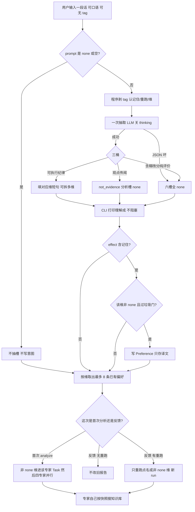

# 口语意图：保守翻译，不多一轮分析

> 状态：**已按审核意见实现理解层；U2 重跑已实现；无 tag 时程序可识别重写/记住/结束**  
> 日期：2026-08-26  
> 位置：本仓库 `doc/`  
> 关联：`用户意图与偏好记忆设计.md`、`U1用户意图伪代码.md`、`U2结果反馈与重跑.md`  
> 问题：用户可能写得很不专业。不新开主 Agent，不给原话做向量检索，不在用户输入后再跑一轮四专家。

---

## 0. 请你拍板的结论

口语处理 = **加强现有那一次抽槽** + **把译文打给用户看** + **含糊则不记住**。

```text
用户输入（可很口语、可无 tag）
  → 程序剥 tag（不变）
  → 仍只调一次抽取 LLM（thinking 关）
  → 六槽：可执行纪律 / none；观点进 not_evidence
  → CLI 打印「理解成……」（不阻塞等确认，除非以后加旗标）
  → #remember 且槽非 none 且过垃圾门 → 写 Preference（statement=译文）
  → 专家仍只跑该跑的那些；偏好按维整包注入，不检索
```

**不增加**分析 loop。不增加「审译文」的第二次模型调用（审时若你要忠实性双检，标成可选 U1.1，默认不做）。

**不把**译后句子拿去 `search_methodology`。知识库仍由专家按快照 flags 搜；用户口径只进 Task 的 `constraints` / `required_questions`。

空 `--prompt none`：行为与今天完全一样（不抽槽）。这是底线。

聊天理解走 **同一轮抽取 LLM**（不新开专家）：除六槽外再输出 `effect`、`dims`。无 `#` 时以模型判断为准（重写/再出一版→rerun，记住→remember，结束/放弃→end）。抽取失败时才退回短词兜底。用户已打的 `#rerun` 等仍优先。

---

## 0.1 处理流程图

专家不因用户输入多跑一轮。知识库不拿用户原话/译文去搜。




## 1. 为什么不是「理解 + 增强检索」

偏好不是搜出来的：下次同 `user_id` + 同维 +（本票或全局）把最多 8 条 active **整包**塞进 Task。检索增强解决不了听错维、装懂、把「写得不行」存成规则。

原话不做 embedding。方法论不拿用户那句话当 query，避免「利润是假的」在现金流并不滞后时硬塞 `kb_cashflow_lag`。

去重改为比 **整句 statement**（或规范化后的 statement），不再靠前 16 字 trigger 当主键逻辑的唯一依据。`trigger` 仍可从译文截前缀存着，冲突键改为 `user_id + scope + statement` 或对 statement 做稳定短哈希（实现时二选一，审定时定）。

---

## 2. 抽取：一次调用，三桶，允许拆维

模型只填现有 JSON 键，不新增合同字段（仍禁止 Optional / 原文落盘）。

| 用户话属于 | 写入 |
|---|---|
| 能落到某一分析维的检查纪律 | 对应维：一句专家能执行的中文，≤200 字 |
| 一句话里两件事 | **拆到多个槽**，每槽一句 |
| 观点、传闻、托市、「我觉得会涨」 | `not_evidence`；各分析槽 `none`（除非同时还有可执行纪律） |
| 纯评价、纯改分、不知哪一维、过短情绪 | 六维 + `not_evidence` 凡能 none 的都 `none` |

忠实性（写进抽取 System，审这段原文）：

- 禁止逐字复制用户正文。  
- **禁止添加用户没点名的指标或规则**（没说现金流就不要写成 FCF；「好贵」最多写成「估值偏高，对照快照估值字段」，不要擅自写五年分位阈值）。  
- 不回答这只股票该不该买。  
- 无关、空、纯骂 → 全 `none`。  
- `#记住` 由程序管 effect，模型不要猜 tag。

建议 few-shot（可放在抽取 user 消息末尾，不进库）：

```text
「别光看便宜」→ fundamental：估值不要只看价格低或 PE 低，须对照快照里已有的估值与质量字段。
「利润好看会不会假」→ fundamental：利润须对照经营现金流等已有质量字段，不能只看利润同比。
「线一直往下好吓人」→ technical：以下行趋势为主，不要把超卖单独当成反转。
「老有回购就能买吗」→ sentiment：回购/增持只作事件，不单独作为买入理由。
「写得太保守了」「3分改成4分」「帮我看看」→ 全 none。
「我同事说要涨」→ not_evidence：他人看多；分析槽 none。
```

抽取失败（JSON 坏）：与 U1 相同，全 none，audit `intent_schema_invalid`，分析照跑。

---

## 3. 回显（给人改译文，不是第二轮模型）

`analyze` / 以后的 `feedback` 在抽槽成功后、专家跑之前或同时，stdout 增加一段（payload 不含用户原话）：

```text
意图理解（非原话）：
  基本面: …… | none
  技术面: none
  …
  不当证据: …… | none
  效力: this_run | remember | …
```

不阻塞。用户觉得译错：再发一次 `--prompt`（或 U2 `feedback`），以新译文为准；`#记住` 时用新句覆盖同维冲突卡。

本期不做：`--confirm-intent` 交互 yes/no。你若要「译错不准跑专家」，另开旗标，默认关。

---

## 4. 什么情况才维护 Preference

仍只维护那张口径卡：`scope + statement + stock_code + status` 等，见既有合同。口语方案 **不新加业务字段**。

写库门闩（程序，不靠模型自觉）：

1. `effect` 含 remember；  
2. 该维槽 ≠ `none`；  
3. **垃圾门**（过任一则该维不写偏好，utterance 仍记）：  
   - 槽长 &lt; 8 个汉字且无明确检查对象；  
   - 仅匹配一小撮评价词（如：不行、不好、保守、乐观、改分、太差、太好）；  
   - 与 `not_evidence` 同义重复且分析槽是硬凑的（实现时宁可漏记）。

`#记住` 但六分析槽全 none：不新增 Preference（与「全 none 不写偏好」已一致）。

`this_run`：不写偏好；译文仍进当次对应维 Task（首次）或按 U2 不改旧报告（反馈且无 rerun）。

---

## 5. 和专家 / 知识库的边界

- 专家 System、工具、schema **不改**。  
- Task 仍是 `用户口径：` + 译文（或问号进 questions）+ 该维已有偏好。  
- 不因口语去多搜知识库、不多调工具。  
- `not_evidence` 不进 citations、不进 Evidence。

---

## 6. 改哪些代码（审过再写）

```text
改  user_intent.py     EXTRACT_SYSTEM + few-shot；可选垃圾门函数
改  user_store.py      去重键改为 statement（或哈希），避免 16 字误伤
改  initial_research.py / CLI   打印意图理解块
改  tests/test_user_intent.py   口语夹具：全 none、拆维、不抄原话、remember 被垃圾门拦住
```

不改：runtime、四专家 System、`search_methodology` 签名、Preference 表结构（除非去重必须加一列 `statement_hash`，有才迁 schema）。

---

## 7. 验收

- 「帮我看看 000858」→ 不抽槽或全 none，专家指令与无 prompt 时一致（若 body 非 none 则一次抽取后全 none）。  
- 「别光看便宜」无 tag → 仅 fundamental 非 none，原文不在库、不在 Task 原文形态。  
- 「我同事说要涨」→ 只 `not_evidence`，无偏好。  
- 「写得不行」+ `#记住` → 无新 Preference。  
- 一次抽取调用次数 = 1（有正文时）；专家次数不因口语增加。  
- 不出现对用户原文的 embedding / 额外 methodology 查询。

---

## 8. 不做

```text
用户输入后再跑一轮四专家
抽取后再固定第二次「审稿」LLM（除非你批 U1.1）
用户原话 / 闲聊向量检索
用用户句检索方法论
交互确认阻塞 analyze（默认）
新记忆字段、画像、跨票语义相似
把口语写进 citations
```

---

## 9. 给你审的三问

1. 回显只打印、不等确认 —— 是否够？  
2. 「好贵」是否允许译成「对照快照估值字段」，还是必须用户说出 PE/估值才填 fundamental？  
3. 去重用整句还是 statement 哈希？整句简单；同义改写会并成两条（可接受）。
